```{r setup, include=FALSE}
knitr::opts_chunk$set(echo = TRUE)
```


# MAPPA

This is a standalone version of MAPPA (MAchine learning of Parameter-Phenotype mapping for Analyzing dynamical biological systems models) implemented using the R Shiny package. Please check the website demonstrating a part of MAPPA for interactive figures (<https://phasespace-explorer.niaid.nih.gov>).

## Table of Contents
1. [How to install and run](#how_to_install_and_run)
2. [Key concepts for using MAPPA](#key_concepts_for_using_MAPPA)
3. [Overall structure of the app](#Overall_structure)
4. [Quick tutorial](#Quick_tutorial)


## How to install and run <a name="how_to_install_and_run"></a>

Install this package using `devtools`. Then, run the function `launch_MAPPA`.

```{r eval=FALSE}
devtools::install_github("pkm304/MAPPA")
library(MAPPA)
launch_MAPPA()
```


## Key concepts for using MAPPA <a name="key_concepts_for_using_MAPPA"></a>

#### PPM (Parameter-Phenotype Map)

A Parameter-Phenotype Map (PPM) consists of parameter space, phenotypic space, and Machine Learning (ML) models connecting parameter space and phenotypic space. ML models can be considered as phenomenological solutions of dynamical models, trained by a data-driven way.

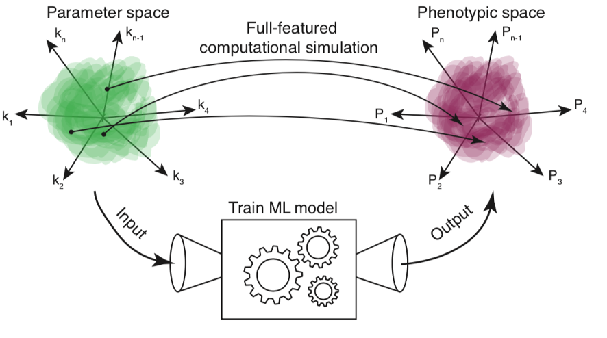

#### Parameter space

A parameter space consists of kinetic parameters of dynamical models and their feasible ranges. As dynamical models become realistic, the dimensionality of the parameter space also increases. Practically we randomly sample parameter combinations to cover the entire parameter space. To intuitively visualize high-dimensional space, we apply t-distributed Stochastic Neighbor Embedding (t-SNE) for the sampled parameter combinations to plot in 2D.

#### Phenotypic space

A phenotypic space consists of a single or multiple phenotype(s). Each phenotype is quantitative or categorical values defining a certain aspect of simulation outcomes throughout the parameter space of a dynamical model, such as single cell gene-gene expression correlations or quality factor for oscillation as in the main paper.

#### Machine Learning (ML) model

A ML model is a random forest regression/classification model. Parameter combinations and phenotypes are input data and output data, respectively for training ML models. In realistic dynamical models with high-dimensional parameter spaces, nonlinearity, and stochasticity, analytical solutions to describe quantitative relationships between parameter and phenotypic spaces are often intractable. Here, ML models can be considered as phenomenological solutions of dynamical models, trained by a data-driven way. Not only ML model can predict phenotypes for given parameter combinations, ML models can also output variable importance in global and local levels, which leads us to better understand behaviors of dynamical models.

#### Variable Importance

The random forest algorithm implemented as the randomForest package in R generates variable importance both in the global level averaged for all data points in training sets and in the local level for each individual data points in training sets with the ‘importance’ and ‘localImp’ options turned on, respectively. Variable importance is the most crucial information to understand the systems’ behaviors in terms of the controllability of each of kinetic parameters. Although the global variable importance (GVI) gives a general overview, the behaviors in the neighborhood of each region of the parameter space can differ each other, and the local variable importance (LVI) does capture this aspect. We can cluster the patterns of LVIs with the hierarchical clustering method and visualize them along with t-SNE plots.

#### Parameter key

Each parameter combination is assigned its own parameter key to make it easily distinguishable and accessible. The basic syntax of parameter keys in this paper is to assign the date when parameter combinations are generated and capital letter combinations (e.g., 042015_AAACEZGP).


## Overall structure of the app <a name = "Overall_structure"></a>


### Graphical user interface

Once MAPPA is launched, A Shiny App will begin showing following default pages.

- Overview
	
	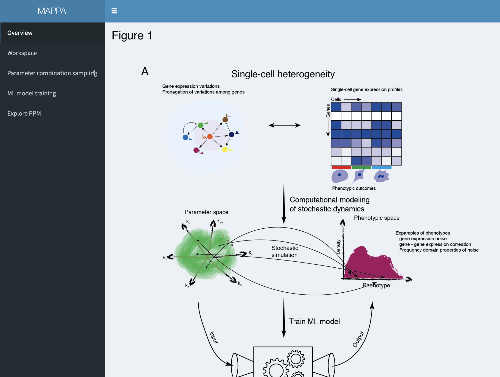

- Workspace

	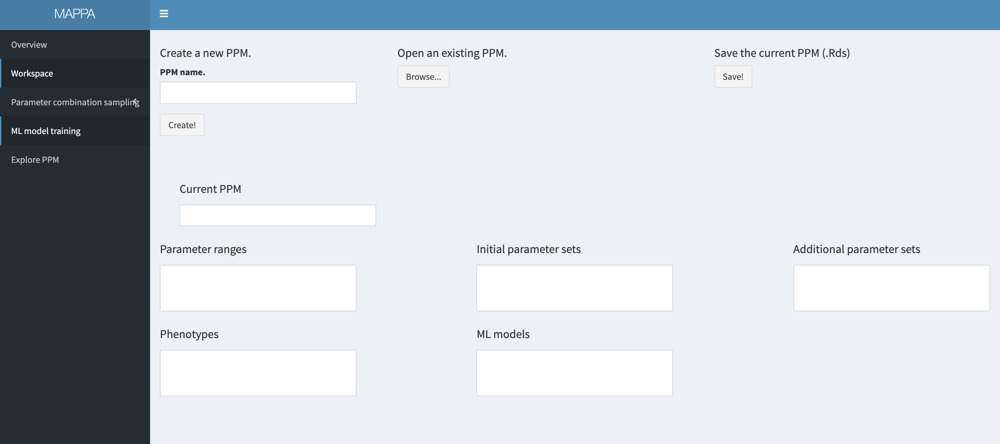

- Parameter combination sampling

	- Initial sampling
	
	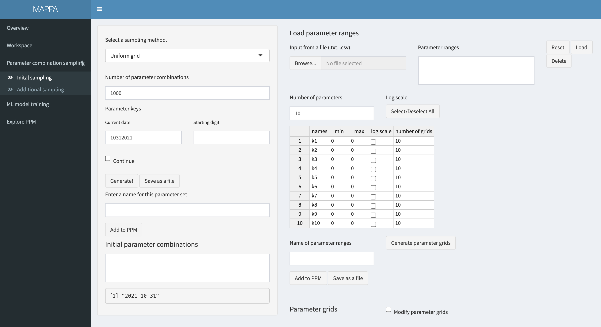

	- Additional sampling
	
	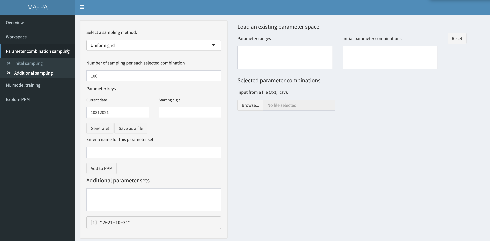

* ML model training
	
	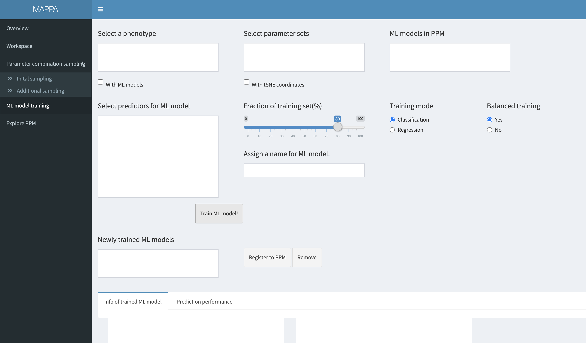

* Explor PPM

	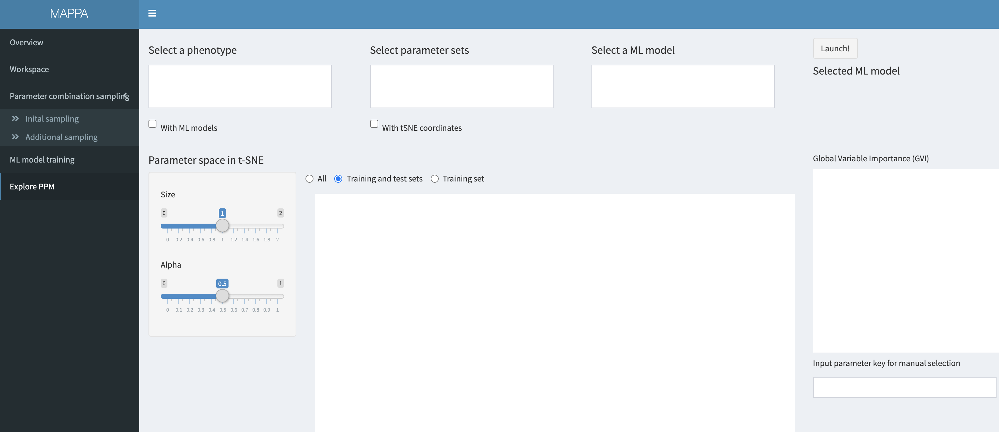
	

### PPM object 

1. Creating a PPM object

This is the central object in the MAPPA package implemented as S4 class type. A PPM object houses parameter space, phentipic space, and ml.models with associated functions to add to and obtain from those elements from a PPM object. A PPM object can be created in the Shiny app or through commands:

```{r}
library(MAPPA)
PPM.obj <- func_create_PPM( PPM.name = "Hello World!")
get.PPM.name(PPM.obj)
```

2. Inspect/Retrieving the elements of the PPM object.

Users can inspect the inside of the created PPM object using access functions or directly using `@` after the object name in the R console.

- using `get.***` functions
	
```{r eval=F}
ppm.name <-  get.PPM.name(object = PPM.obj)
ppm.prms.space <- get.prm.ranges(object = PPM.obj)
## There are other functions to access the objects.
```

- or use `@` 

```{r eval=F}
PPM.obj@
```

There are several more `get.***` functions to be listed below. Users do not have to know all of these functions and can almost entirely rely on the Shiny app. However, some functions are necessary since MAPPA does not provide all extra packages, yet. This will be explained in the Quick tutorial section when required.
 
3. Overall data structure of a PPM object

Since the created object `PPM.obj` is almost empty, all the elements preset at the creation can be shown as below. (Please do not try this with an objects with filled elements).

```{r}
PPM.obj
```


## Quick tutorial <a name="Quick_tutorial"></a>

### Overall workflow

1. Define a dynamical model and determine parameters to be varied with their associated plausible ranges.

2. Create a PPM object.

3. Sample initial parameter combinations uniformly across parameter space defined by the plausible prameter space. Additional sampling can be performed adpatively focusing on certain region of interest later on.

3. (Not part of MAPPA) Run simulations for sampled parameter combinations and obtain phenotypes of interest out of the simulation results. 

4. (Back to MAPPA) Register the obtained phenotypes out of simulations to the PPM object (to be explained in the Example section below).

5. Train machine learning models mapping parameter space to phenotypes obtained from simulations, thereby obtaining all emements of PPMs (parameter space, phenotypic space, machine learning models mapping parameter space and phenotypic space).

6. Explore PPMs using various visualization methods.

### Example

In this section, we walk through MAPPA using an example model of the germinal center (GC) reaction, which is an ODE model describing the interactions of germinal center B cells, T follicular helper cells, and T follicular regulatory cells at the cell population level to dissect the duration of GC reactions.

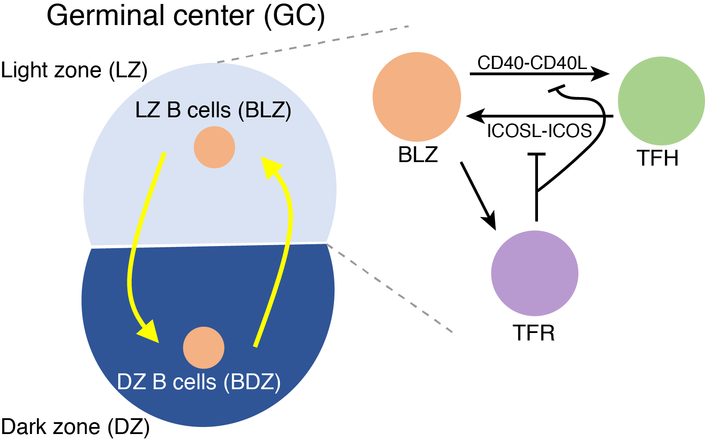

#### Define a dynamical model and determine parameters to be varied with their associated plausible ranges

First, based on typical parameter values and biological consideration, we define a set of parameter ranges by choosing parameters to vary and defining their associated rangee as a data frame with columns of `name`, `min`, `max`. Save the data frame object in the csv format. Please adhere to this format specified for MAPPA. 

```{r eval= T}
# Typical parameter values
prms.typical <- c(K_tfh_blz = 0.1,
									n_tfh_blz = 1,
									r_tfh_0 = 0.7,
									d_tfh_0 = 0.7,
									K_blz_tfh = 1.2,
									n_blz_tfh = 1,
									r_tfr_0 = 0.7,
									d_tfr_0 = 0.7,
									K_blz_tfr = 10,
									n_blz_tfr = 1,
									K_tfr_tfh = 1/5)

# Parameter ranges
# Users flexiably specifiy ranges based on their own purpose and qustions.
# For simplicity, MAPPA deals with only positive values. Respective signs can be restored at the actual simulation codes.
prms.ranges <- data.frame(name = c("K_tfh_blz", "n_tfh_blz", "K_blz_tfh", "n_blz_tfh",  "K_blz_tfr", "n_blz_tfr", "K_tfr_tfh"),
												 min =  c(0.05,         0.2,          1,           0.2,         5,          0.2,           0.2      ),
												 max =  c(0.15,         5,            1.5,         5,           10,           5,            0.5 ))

#Save as csv files with header names, names, min, max
write.csv(prms.ranges, file = "examples/prm_ranges.csv", quote = F, row.names = F)

```

#### Create a PPM object and register the defined parameter ranges 
##### Launch MAPPA using `launch_MAPPA()`, preferablly from a new R session.
```{r eval=F}
library(MAPPA)
launch_MAPPA()
```


##### Create and save a PPM object

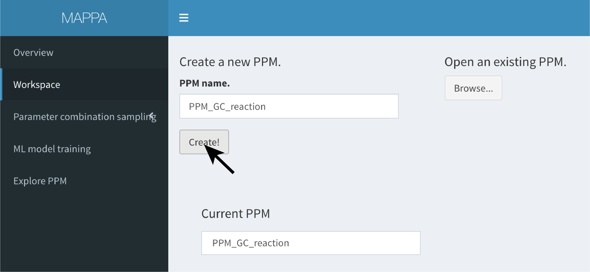

Since currently MAPPA is not stable, please make sure save the PPM object frequently not to lose the analysis results.

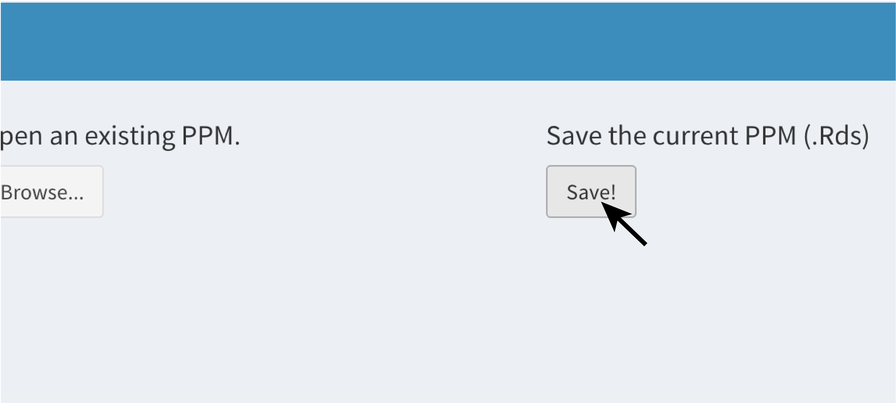

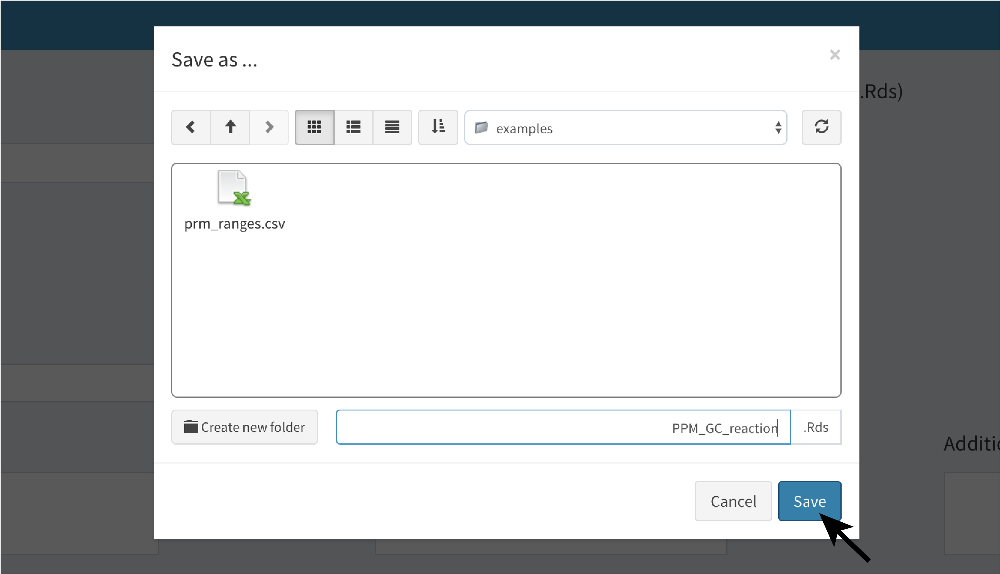

##### Register parameter ranges to PPM and sample parameter combinations

Go to the `Parameter combination sampling` --> `Initial sampling` tab.

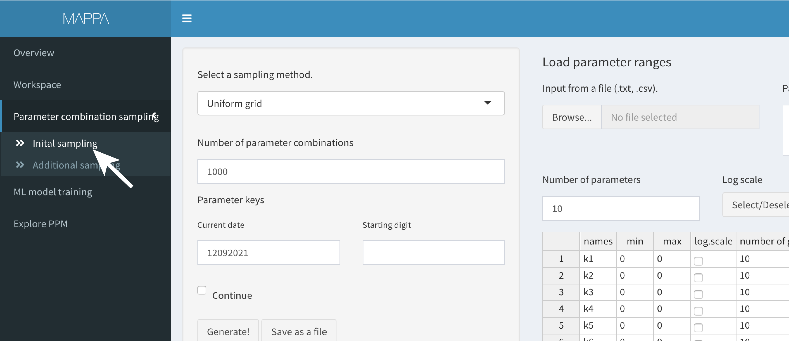


Load the parameter ranges.

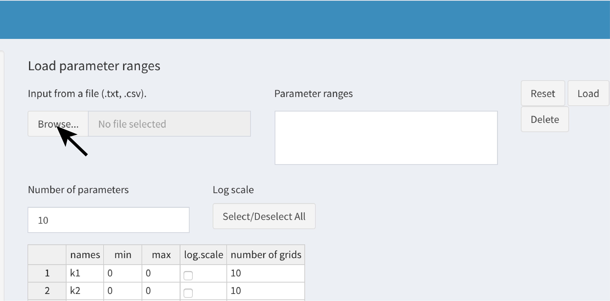


##### Register the parameter ranges to PPM and sample parameter combinations.

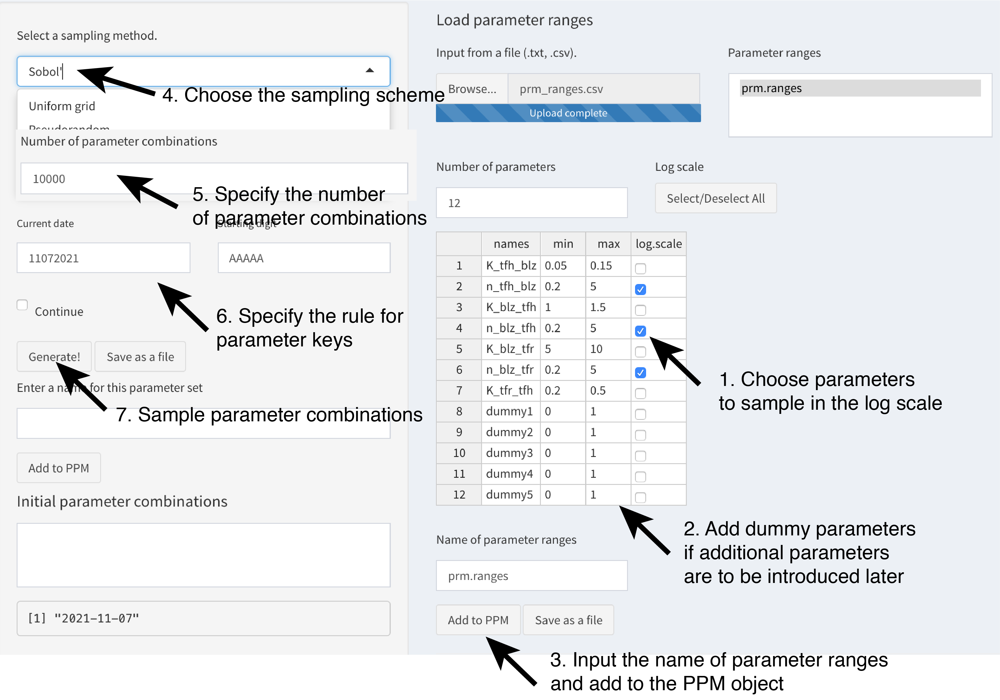

Register the sampled parameter combinations to PPM and save as a text file.

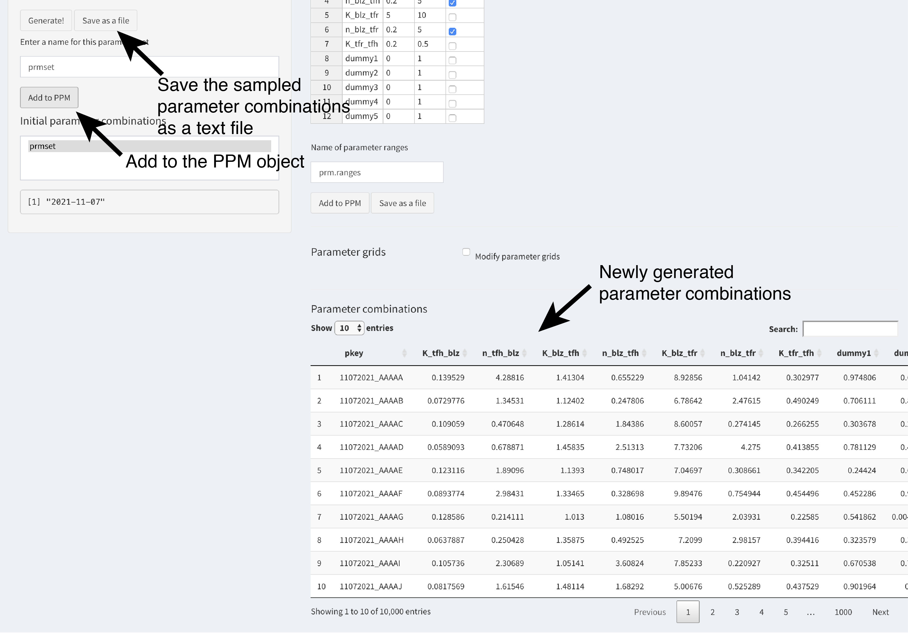

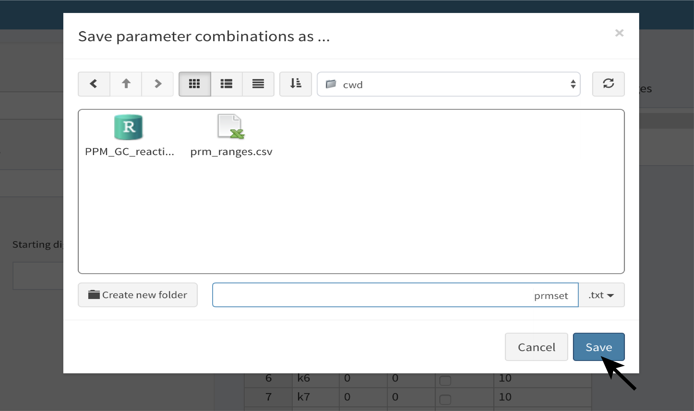

##### Generate tSNE or UMAP emebedding of the sampled parameter combinations.

We have not included tSNE and UMAP in MAPPA yet. Users are encouraged to generate the embeddings on their own.

```{r eval= T}
library(Rtsne)

#Load the PPM object.
PPM.obj <- readRDS("examples/PPM_GC_reaction.Rds")

#Obtain the generated parameter combinations.
prmset.list <- get.init.prm.combs(object = PPM.obj,
																	prm.ranges.name = "prm.ranges", #Specify the exact name of the parameter ranges defined in MAPPA
																	name = "prmset" ##Specify the exact name of the parameter combinations defined in MAPPA
																	)

names(prmset.list)
```

There are 6 elements in the retieved list.

* method: sampling method.
* log.scale: whether parameters are sampled in the log scale or not.
* raw.smpl: raw values of sampled parameter combinations between 0 and 1 for Sobol', pseudorandom, and latin hypercube.
* prm.combs: sampled parameter combinations.
* prm.combs.z: standardized sampled parameter combinations.
* rd_seed: seed numbers assigned to each parameter combination for stochastic simulations.

```{r eval= F}
#Use the standardized parameter combinations for embedding
if(0){ #Do not run for the tutorial since it may takes long.
	prmset.tsne <- Rtsne( prmset.list$prm.combs.z[,2:8])
  prmset.tsne <- data.frame(pkey = prmset$pkey, prmset.tsne$Y)
  names(prmset.tsne) <- c("pkey", "tSNE1", "tSNE2")
}
#tSNE was prepared for this tutirial, 
prmset.tsne <- readRDS("examples/tSNE_tutorial.Rds")


# Register the tSNE embedding to the PPM object
PPM.obj <- readRDS("examples/PPM_GC_reaction.Rds")
add.tsne.coord(PPM.obj) <- list( prm.combs.name = "prmset", ##Specify the exact name of the parameter combinations defined in MAPPA
                                       tsne.coord = prmset.tsne)
saveRDS(PPM.obj,"examples/PPM_GC_reaction.Rds")

```


##### Conduct simulations across sampled parameter combinations, aggregate simulation results, define (a) phenotype(s) of interest, and register to PPM. (This should be done outside of MAPPA.)

Users can conduct simulations for the model across sampled parameter combinations with any tools of their preferences. For the GC reaction model, we conducted the simulations usmg the Matlab. Here, we showcase MAPPA using the simulations results in scheme 2:

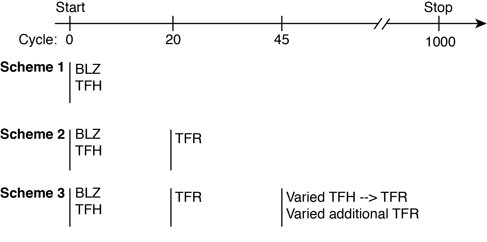

We aggregated the simulation results for the demonstration purpose here.

```{r}
#Load simulation results
df.sim.results <- readRDS("examples/sim_results_tutorial.Rds")

#Plot all simulation results
library(tidyverse)
df.sim.results %>%   ggplot() +geom_line(aes(x=Time, y = B_gc, group = pkey), alpha = 0.05) 
df.sim.results %>%   ggplot() +geom_line(aes(x=Time, y = TFH, group = pkey), alpha = 0.05)
df.sim.results %>%   ggplot() +geom_line(aes(x=Time, y = TFR, group = pkey), alpha = 0.05)
```


